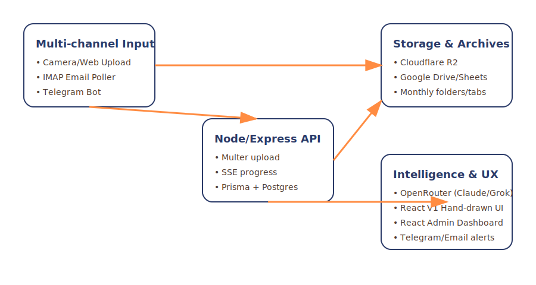
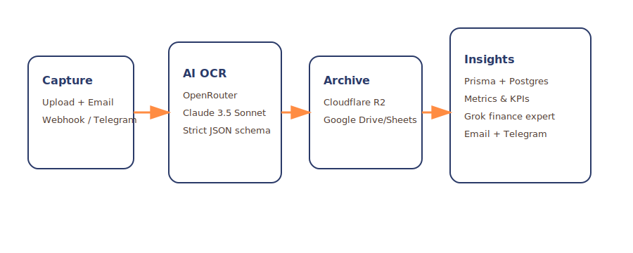
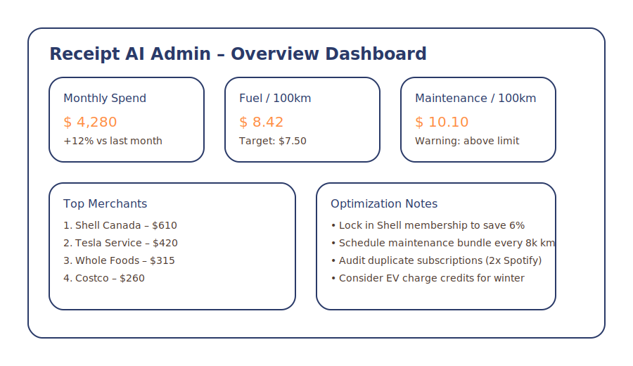

# Receipt Manifestation App

A high-fidelity mobile web application for managing receipts with a bold, hand-drawn "Manifestation" aesthetic. It serves as a "Digital Altar" for your financial data, transforming chaos into structured abundance.

## 🌟 Features

*   **Hand-Drawn UI**: Organic textures, sketchy borders, and a warm, paper-like atmosphere.
*   **Receipt Capture**: "Tarot Card" style upload interface.
*   **AI Intelligence**: Uses **OpenRouter (Claude 3.5 Sonnet)** for high-precision OCR and data extraction.
*   **Multi-Channel Input**:
    *   📸 **Web Upload**: Direct photo upload from mobile/desktop.
    *   📧 **Email Listening**: Automatically scans inbox for receipt attachments (IMAP).
*   **Cloud Archiving**:
    *   🖼️ Original files saved to **Google Drive**.
    *   📊 Structured data recorded in **Google Sheets**.

## 🛠️ Tech Stack

*   **Frontend**: React (Vite), Tailwind CSS, Framer Motion
*   **Backend**: Node.js, Express
*   **Integrations**: OpenRouter API, Google Drive API, Google Sheets API, IMAP

## 🚀 Getting Started (V1)

1.  **Install Dependencies**:
    ```bash
    npm install
    ```

2.  **Configuration**:
    *   Copy `server/env.example` to `server/.env`.
    *   Fill in your `OPENROUTER_API_KEY`, Google Credentials, and Email settings.

3.  **Run the App**:
    ```bash
    npm run dev
    ```
    This starts both the frontend (`http://localhost:5173`) and backend (`http://localhost:3001`).

## ⚙️ V2 Upgrade Snapshot

The V2 release introduces:

- **PostgreSQL + Prisma** for long-term data retention, metrics, and AI-ready datasets.
- **Indicator Engine** so you can define or disable KPIs (fuel/100km, maintenance/100km, recurring payments, etc.).
- **React Admin Back-Office** (`apps/admin`) with dashboards, vehicle insights, and AI reports.
- **AI Finance Expert** powered by OpenRouter (Claude + Grok) to generate monthly recommendations and email summaries.
- **Dockerized Deployment** via `docker-compose` (server + worker + Postgres + admin/frontend).

All new environment variables live in `server/env.example` (runtime) and `env.docker.example` (compose defaults). Copy them to `.env` / `server/.env` before running.

### Visual Overview

| Architecture | Pipeline | Admin Dashboard |
| --- | --- | --- |
|  |  |  |

### Admin Console

- Source code: `apps/admin`
- Development: `cd apps/admin && npm run dev` (defaults to `http://localhost:5173`)
- Build output: `apps/admin/dist` (served by Docker `frontend-admin` service in future iterations)
- Requires `VITE_API_BASE_URL` (inherit from root `.env.production`) so it can reach `/api/v2/*`.

### Docker Quick Start

1. `cp env.docker.example .env` and edit values (API base URL, SMTP, etc.).
2. `cp server/env.example server/.env` (or create a clean secret file).
3. `docker compose up -d --build`.
4. API will listen on `http://localhost:3001`, frontend on `http://localhost:8080`.
5. Seed & import helpers:
   - `docker compose run --rm server npm run prisma:migrate`
   - `docker compose run --rm server npm run seed`
   - `docker compose run --rm server npm run import:lowdb`

## 🔮 Design System

*   **Font**: 'Patrick Hand' (Headers), 'Inter' (Body)
*   **Colors**: Paper White (`#F8F4EC`), Ink Brown (`#4E3B31`), Vitality Orange (`#FF8C42`).
